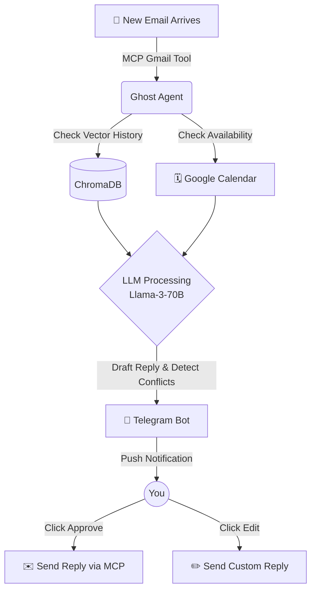

<div align="center">
  
# 👻 Ghost Email Manager
**The Autonomous AI Email & Calendar Agent powered by LLMs and MCP**

[](https://www.python.org/downloads/)
[](https://opensource.org/licenses/MIT)
[](http://makeapullrequest.com)

*Handle schedule conflicts and daily emails autonomously without human input.*

---

**GitHub Tags (Add these to your repo settings!):**
`ai-agent` `llm` `mcp` `gmail-api` `google-calendar` `automation` `python` `agentic-workflow` `rag` `chromadb` `fastapi` `streamlit` `telegram-bot` `llama3` `groq` `email-manager` `scheduling-assistant`

**Repo 'About' Section (Copy & Paste):**
An autonomous AI agent using Llama-3, MCP, and RAG to intelligently classify emails, resolve schedule conflicts, and manage your inbox via Telegram & Streamlit.

</div>

<br>

## 🎭 The Problem vs. The Solution

**The Problem:** Managing a high-volume inbox is a full-time job. Missed meetings, double-bookings, and endless "sounds good, looking forward to it" emails drain your focus. Traditional filters are too rigid, and AI email generators still require you to click, read, and send manually.

**The Solution:** Ghost Email Manager is a completely autonomous email & calendar engine. It acts as an intelligent proxy—reading your emails, checking your live Google Calendar availability, handling double-booking conflicts autonomously, and generating highly contextual replies. With a Telegram integration, it pings you with a one-tap "Approve/Reject" button before taking action.

## ✨ Killer Features

- 🧠 **Agentic LLM Pipeline:** Powered by Groq's insanely fast **Llama 3 70B** to intelligently classify emails into nuanced categories (Finance, Urgent, Meeting, etc.).
- 📅 **Autonomous Conflict Resolution:** Integrates with Google Calendar via the Model Context Protocol (MCP). It instantly flags double-bookings and suggests alternate times without your input.
- 💬 **One-Tap Telegram Approvals:** Never open your email client again. Review AI-drafted replies right inside Telegram and tap ✅ to send, or ✏️ to rewrite.
- 🔍 **Persistent Memory (RAG):** Uses **ChromaDB** vector storage to instantly recall past conversations with a sender, guaranteeing highly contextual replies.
- 📊 **Real-Time Streamlit Dashboard:** Command center for viewing analytics, overriding approvals, and tracking your inbox zero progress.
- 🗄️ **Bulletproof State Management:** SQLite handles concurrent multi-user states and tracks what's approved vs pending in real-time.

## 🔄 How it Works flow



## 🚀 Installation & Setup

### 1. Clone & Install
```bash
git clone https://github.com/yourusername/ghost-email-manager.git
cd ghost-email-manager

python -m venv venv313
source venv313/bin/activate  # On Windows: .\venv313\Scripts\activate

pip install -r requirements.txt
```

### 2. Configure Environment Variables
Copy the `.env.example` file:
```bash
cp .env.example .env
```
Fill in the following variables in `.env`:
- `GROQ_API_KEY`: Get this from [Groq Console](https://console.groq.com)
- `TELEGRAM_BOT_TOKEN`: Create a bot using [@BotFather](https://t.me/botfather)
- `TELEGRAM_USER_ID`: Your chat ID (Use @userinfobot to find it)

### 3. Google API Credentials
1. Go to the [Google Cloud Console](https://console.cloud.google.com/).
2. Enable the **Gmail API** and **Google Calendar API**.
3. Create Desktop OAuth 2.0 Client credentials.
4. Download the file and save it as `credentials.json` in the root directory.

### 4. Blast Off 🚀
Run the master start script to initialize the Streamlit dashboard, FastAPI backend, and Telegram listeners simultaneously:
```bash
python start.py
```
> *On the first run, a browser window will open asking you to authenticate with Google. This generates the secure `token.json` used for background processing.*

## 🛣️ Roadmap & Future Scope

- [ ] Multi-inbox support for handling multiple Google Workspaces
- [ ] Slack/Discord approval integrations
- [ ] Local LLM capability using Ollama (100% private processing)
- [ ] Automated attachment summarization

## 🤝 Contributing

Contributions make the open-source community an amazing place to learn, inspire, and create. Any contributions you make are **greatly appreciated**. 

1. Fork the Project
2. Create your Feature Branch (`git checkout -b feature/AmazingFeature`)
3. Commit your Changes (`git commit -m 'Add some AmazingFeature'`)
4. Push to the Branch (`git push origin feature/AmazingFeature`)
5. Open a Pull Request

## 🛡️ License

Distributed under the MIT License. See `LICENSE` for more information.

---
<div align="center">
<b>Built with ❤️ using Groq, ChromaDB, MCP, and Streamlit.</b><br>
Drop a ⭐ if you found this project helpful!
</div>
